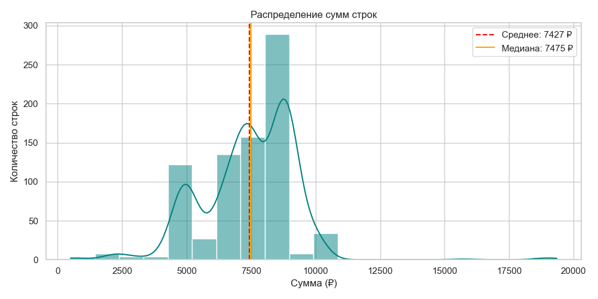
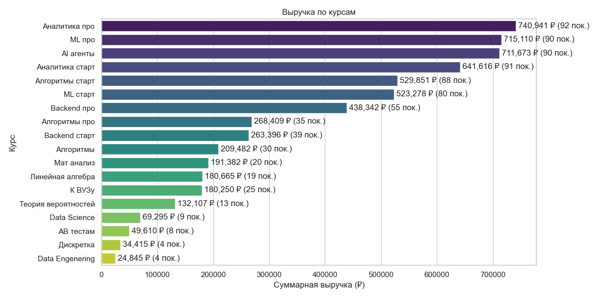
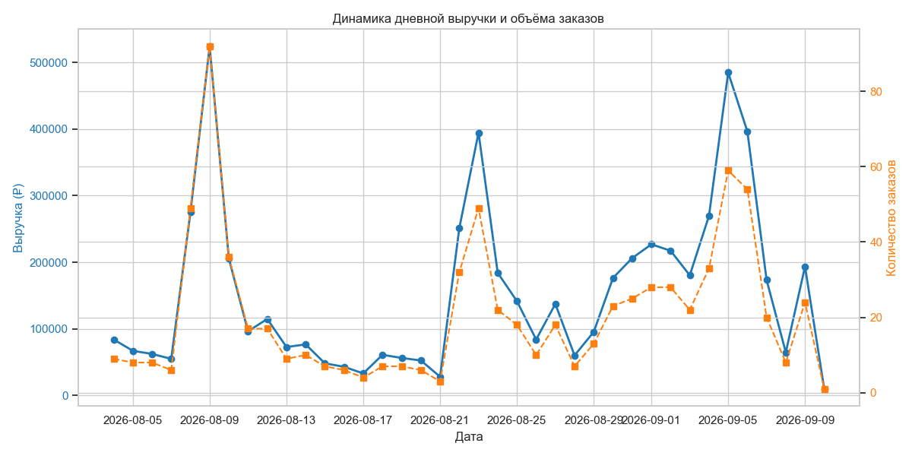

# EDA: что мы узнали из продаж «Поступашки»

Разбор `data/base.xlsx` по задаче 1 кейса. Всё, что здесь написано,
воспроизводится ноутбуком [`notebooks/01_eda.ipynb`](../notebooks/01_eda.ipynb) —
открыть и выполнить ячейки сверху вниз. Графики, на которые здесь есть
ссылки, лежат в этой же папке, в `figures/`, и генерируются тем же
ноутбуком.

---

## Часть 1. Что мы знаем — факты из данных

### Размер и период

| Показатель | Значение |
|---|---|
| Строк в файле | 795 |
| Заказов после склейки | 628 |
| Уникальных покупателей | 606 |
| Курсов | 18 |
| Период | 04.08.2026 — 10.09.2026, 38 дней |
| Общая выручка | 5 904 672 ₽ |
| Средний чек заказа | 7427.26 ₽ |
| Медианный чек заказа | 7475.0 ₽ |

Пропусков нет. Полных дублей строк нет.

### Граница заказа определяется однозначно

Мы боялись, что придётся
подбирать окно сколько минут между строками считать одним заказом.
Подбирать не пришлось:

- всего 189 пар соседних покупок одного человека;
- **167 из них разделены ровно 0 секунд** — то есть совпадают до секунды;
- следующий по величине разрыв — **1 589 секунд (26 минут)**;

Мы берём правило «заказ = строки с одинаковой
отметкой времени». 795
строк складываются в 628 заказов.

### Структура заказов

- **475 заказов** — один курс
- **145 заказов** — два курса
- **8 заказов** — три и больше (максимум пять)

Итого 153 заказа (24,4%) содержат больше одного курса.

### Гипотеза про продажу курсов пакетами подтвердилась

В условии сказано: «иногда два курса продавались пакетом». Проверили — так и есть, и таких пакетных цен несколько:

| Сумма заказа из 2 курсов | Сколько заказов |
|---|---|
| 14 950 ₽ | 56 |
| 9 900 ₽ | 24 |
| 13 950 ₽ | 15 |
| 9 990 ₽ | 14 |
| 16 950 ₽ | 9 |

Самый частый пакет — **14 950 ₽**.

### Что покупают вместе

| Сочетание | Заказов |
|---|---|
| ML старт + Алгоритмы старт | 24 |
| Аналитика про + Аналитика старт | 23 |
| AI агенты + ML про | 18 |
| ML про + ML старт | 13 |
| Алгоритмы старт + Аналитика старт | 10 |
| Алгоритмы про + Алгоритмы старт | 10 |

Люди берут либо связку «старт + про» одного направления, либо два
смежных направления.

**Отдельное наблюдение: курс «К ВУЗу» не сочетается ни с чем.** Все 26 его
покупок - одиночные заказы. Это единственный такой курс, похоже, у него своя аудитория, и продвигать его теми же связками, что
остальные, не стоит.

### Цены идут чёткими ступеньками

На 795 строк приходится **всего 55 уникальных значений цены**, а
топ-12 покрывают **82% всех строк**.

| Цена | Строк |
|---|---|
| 8 950 ₽ | 149 |
| 7 475 ₽ | 143 |
| 4 950 ₽ | 65 |
| 8 450 ₽ | 54 |
| 6 490 ₽ | 47 |
| 6 975 ₽ | 42 |



Две опорные цены — 8 950 и 7 475 ₽ — вместе дают почти 37% строк. Это
фундамент для следующего раздела: раз у цен есть чёткие ступеньки, то
отклонение цены вниз можно читать как акцию, а не как случайный шум.


### Выходные решают всё

| День недели | Заказов |
|---|---|
| Понедельник | 87 |
| Вторник | 65 |
| Среда | 73 |
| Четверг | 53 |
| Пятница | 49 |
| **Суббота** | **125** |
| **Воскресенье** | **176** |

Суббота и воскресенье дают **48% всех заказов и 45% выручки**. Любая
модель прогноза обязана учитывать день недели — иначе она будет
систематически ошибаться.

### Концентрация по курсам



Топ-6 курсов из 18 дают **65% выручки**. Лидеры: Аналитика про
(741 тыс. ₽), ML про (715 тыс.), AI агенты (712 тыс.).

---

## Часть 2. Что мы оцениваем — наши выводы из данных

### Мы восстановили календарь скидок

Прайс-листа нам не дали. Но у нас есть цена каждой продажи и дата. Если
считать ценой курса его максимальную цену за период, то скидка
каждой продажи = `1 − цена / полная цена`. Усреднив по дням, получаем
календарь акций:

| Период | Медианная скидка | Что это вероятно было |
|---|---|---|
| 04–07 августа | 1–9% | обычные дни |
| **08–11 августа** | **44–45%** | **крупная распродажа** |
| 12–15 августа | 22–49% | затухающий хвост акции |
| 16–21 августа | 0–12% | обычные дни |
| 22–27 августа | 5–22% | умеренная акция |
| 28 авг — 09 сен | 0–22% | волнообразно, с промо по выходным |



**Это и есть частичный ответ на задачу 2** — восстановить маркетинговую
историю. Мы достали её из цен, вообще не заходя в Telegram.

Осторожность: если какой-то курс ни разу не продавался по полной цене,
его «полная цена» у нас занижена, а значит скидки по нему занижены тоже.
Цифры — оценка, а не факт.

### Скидка и всплески продаж совпадают, но это ещё не доказательство

Три всплеска продаж:

| Дата | Заказов | Что рядом |
|---|---|---|
| 09 августа (вс) | **68** | пик распродажи 45% |
| 23 августа (вс) | 39 | акция ~16% |
| 05–06 сентября (сб–вс) | 49 и 45 | акция ~16% |

Все три пришлись на выходные. Но это ловушка, ведь продажи могли вырасти после скидки. Отделить эффект скидки от эффекта выходного
дня на этих данных нельзя, потому что акции запускали именно по
выходным.

### Мы можем оценить время публикации продающего поста

9 августа, самый крупный день:

```
09:00 — 6 заказов
10:00 — 7 заказов
...
15:00 — 0 заказов
16:00 — 18 заказов   ← резкий скачок
17:00 — 7 заказов
18:00 — 10 заказов
```

В обычный день в 16:00 происходит около 2 заказов. Скачок до 18 после
полного нуля в 15:00 — это очень похоже на реакцию на публикацию около
16:00. В этот же час зафиксирована плотная группа заказов с одинаковой
нестандартной ценой (16:12, 16:24, 16:26). Похожая группа есть 6
сентября (15:18–16:23).


## Часть 3. Чего из этих данных узнать нельзя

Честный список, прямо в презентацию:

1. **Откуда пришёл покупатель.** В файле нет ни одного поля про источник.
   Ни одного. Это и есть главная дыра, ради которой существует весь кейс.
2. **Сколько потратили на рекламу.** Ни одной цифры затрат. Значит,
   **исторический ROMI посчитать нельзя в принципе** — в формуле нечем
   заполнить знаменатель.
3. **Что было до 4 августа.** 38 дней — очень короткая история. Для
   прогноза с недельной сезонностью это чуть больше пяти повторений цикла.
4. **Эффект скидки отдельно от эффекта выходного дня.** Переплетены,
   разделить нельзя (см. часть 2).
5. **Настоящее число повторных покупателей.** Идентификатор в исходном
   процессе строился из username, а username можно поменять — тогда
   человек выглядит новым. Плюс окно наблюдения всего 38 дней. 3,3% —
   нижняя граница.
6. **Был ли человек вообще под воздействием рекламы.** Органику от
   рекламных продаж на этих данных не отделить никак.
